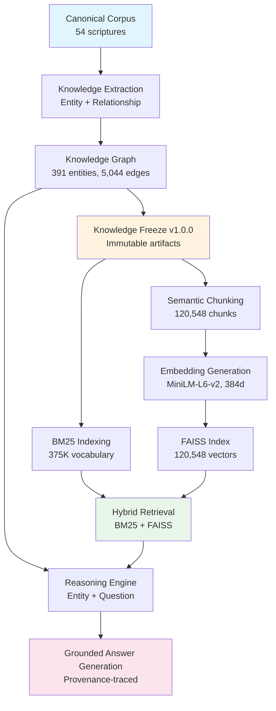

# AstroSage Architecture Book

**Version**: 1.0.0
**Last Updated**: 2026-07-19

---

## 1. System Overview

AstroSage is an Evidence-First Knowledge Operating System designed to preserve, reconstruct, validate, connect, retrieve, and reason over knowledge from Hindu scriptures while maintaining complete provenance and verifiable evidence.

### Design Principles

1. **Evidence-first**: Every knowledge claim must be traceable to canonical source material
2. **Provenance-preserving**: Source, edition, processing method, and confidence are always recorded
3. **Immutable by default**: Once frozen, knowledge artifacts cannot be modified; changes require versioned migrations
4. **Reproducible**: Given identical inputs, every pipeline produces identical outputs
5. **Self-documenting**: The repository maintains its own documentation, indexes, and state

---

## 2. Repository Map

```
Astrosage-/
├── knowledge/                          # Knowledge infrastructure
│   ├── releases/v1.0.0/               # Immutable frozen release
│   │   ├── graph/                      # Knowledge graph
│   │   ├── chunks/                     # Semantic chunks
│   │   ├── embeddings/                 # Vector embeddings
│   │   ├── retrieval/                  # Search indexes
│   │   ├── reasoning/                  # Reasoning artifacts
│   │   └── answers/                    # Grounded answers
│   ├── migrations/                     # Versioned knowledge evolution
│   ├── cku_registry/                   # Canonical unit registry
│   ├── graph/                          # Working knowledge graph (pre-freeze)
│   └── cvu/                            # Canonical verification units
├── scripts/                            # Pipeline implementations
├── docs/                               # Documentation
├── .agent/                             # AI operating layer
├── .ai/                                # AI knowledge metadata
└── .astrosage/                         # Configuration
```

---

## 3. Data Flow Architecture



---

## 4. Knowledge Graph Architecture

### 4.1 Node Structure

Every graph node contains:

```json
{
  "GUID": "6cdcd4d1-d8b4-53cf-83aa-0d3c6e309dbf",
  "name": "Vishnu",
  "type": "Deity",
  "entity_type": "Deity",
  "total_mentions": 610,
  "sources": ["Vedārthasaṃgraha", "Bhagavadgītā..."],
  "provenance": {...},
  "mentions": [...]
}
```

### 4.2 Edge Structure

Every graph edge contains:

```json
{
  "GUID": "...",
  "type": "INCARNATION_OF",
  "source_GUID": "...",
  "target_GUID": "...",
  "evidence": "canonical_scripture",
  "confidence": 0.95,
  "phase": "9.5"
}
```

### 4.3 Relationship Types (68)

The graph uses 68 distinct relationship types across 5,044 edges:

- **Genealogical**: FATHER_OF, MOTHER_OF, SON_OF, DAUGHTER_OF, SISTER_OF, BROTHER_OF, HUSBAND_OF, WIFE_OF, ANCESTOR_OF, DESCENDANT_OF, UNCLE_OF
- **Religious**: TEACHER_OF, TAUGHT, TAUGHT_IN, TEACHES, DEVOTEE_OF, BLESSES, COUNSELS
- **Cosmological**: INCARNATION_OF, ABODE_OF, CREATOR_OF, PROTECTS, LOVES, SERVES
- **Geographical**: RULER_OF, KING_OF, KINGDOM_OF, FOUNDED, TRAVELS_TO, RESIDES_IN
- **Scriptural**: MENTIONED_IN, APPEARS_IN, REFERRED_TO_IN, STATED_IN, USED_IN
- **Philosophical**: DEFINES, DEFINED_AS, CONTRASTS_WITH, OPPOSITE_OF, SUBCATEGORY_OF
- **Ritualistic**: OFFERED_TO, REQUIRES, PERFORMS, USES, INITIATES, COMPLETES
- **Conceptual**: PATH_TO, LEADS_TO, LIBERATION_FROM, GENERATES, ASSOCIATED_WITH
- **Martial**: DEFEATS, FIGHTS, OVERCOME_BY, WIELDED_BY, VEHICLE_OF

---

## 5. Semantic Chunking Architecture

Chunks are generated at 5 semantic levels with deterministic IDs:

```
SHA256(astrosage.chunk.v1.{scripture}.{level}.{ref})[:24]
```

### Chunk Levels

| Level | Count | Description |
|-------|-------|-------------|
| scripture | 54 | One chunk per scripture with metadata summary |
| verse | 119,904 | One chunk per verse/canonical unit |
| dialogue | 170 | One chunk per dialogue with speaker/listener/topic |
| event | 29 | One chunk per event with participants/location |
| entity | 391 | One chunk per entity with all mentions and relationships |

### Chunk Schema

```json
{
  "chunk_id": "a920b6ce1154061fb3447253",
  "level": "verse",
  "scripture_id": "...",
  "canonical_ref": "BG 2.13",
  "chapter": "2",
  "verse_range": "13",
  "text": "dehīno 'smin yathā dehe...",
  "entity_links": [...],
  "relationship_links": [...],
  "dialogue_links": [...],
  "event_links": [...],
  "concept_links": [...],
  "provenance": {...},
  "metadata": {...},
  "hash": "..."
}
```

---

## 6. Embedding Architecture

### Model

- **Model**: `all-MiniLM-L6-v2` (sentence-transformers)
- **Parameters**: ~22M
- **Dimensions**: 384
- **Max sequence length**: 256 tokens
- **Normalization**: L2-normalized

### Artifacts

| Artifact | Size | Description |
|----------|------|-------------|
| `embeddings.npy` | 176.6MB | NumPy array of shape [120548, 384] |
| `faiss_index.bin` | 176.6MB | FAISS inner-product index |
| `chunk_id_mapping.json` | 3.3MB | Chunk ID → embedding index mapping |
| `embedding_manifest.json` | 1.2KB | Model metadata + SHA256 hashes |

### Generation

```bash
python3 scripts/phase12_embeddings.py
# ~57 minutes on CPU, ~6 minutes on GPU
```

---

## 7. Hybrid Retrieval Architecture

### Search Strategy

The hybrid retriever combines lexical and semantic search:

```
score = α × semantic_score + (1 - α) × bm25_score
```

Default: `α = 0.6` (60% semantic, 40% lexical)

### BM25 Configuration

- **Algorithm**: Okapi BM25
- **Parameters**: k1=1.5, b=0.75
- **Vocabulary**: 375,327 tokens
- **Index size**: 11.7MB

### FAISS Configuration

- **Index type**: IndexFlatIP (inner product on L2-normalized vectors)
- **Vectors**: 120,548 × 384
- **Distance metric**: Cosine similarity (via L2-normalization + inner product)

### Performance

| Metric | Value |
|--------|-------|
| Search latency (avg) | 38ms |
| Search latency (max) | 64ms |
| Index load time | 310ms |
| Vocabulary size | 375K tokens |

---

## 8. Reasoning Architecture

### Entity Reasoning

For a given entity, the reasoning engine:

1. Loads the entity's graph node (GUID, type, mentions, sources)
2. Traverses all edges (relationships)
3. Loads semantic chunks where the entity appears
4. Constructs an evidence chain combining graph and textual evidence
5. Computes confidence based on source diversity and relationship density

### Question Reasoning

For a natural language question:

1. Identifies relevant entities using hybrid search
2. Loads entity graph data
3. Performs graph traversal for relationships
4. Loads semantic chunks for textual evidence
5. Constructs a multi-source evidence chain
6. Scores confidence based on evidence quality and quantity

---

## 9. Grounded Answer Generation

The answer generator combines entity reasoning with retrieval:

1. Takes a question as input
2. Extracts entities from the question
3. Runs entity reasoning for each entity
4. Runs hybrid search for additional context
5. Combines graph evidence with textual evidence
6. Produces a structured answer with:
   - Entity information (type, mentions, sources)
   - Key relationships
   - Scripture references
   - Evidence sources
   - Confidence level

---

## 10. AI Operating Layer

### Purpose

The AI Operating Layer (`.agent/`, `.ai/`, `.astrosage/`) provides a low-token interface for future AI agents to understand the repository state without scanning source code.

### Components

| File | Purpose |
|------|---------|
| `.agent/PROJECT_STATE.md` | Current repository state, metrics, navigation |
| `.agent/CURRENT_PHASE.md` | Active phase, completed work, capabilities |
| `.agent/TODO_NEXT.md` | Remaining tasks and future work |
| `.ai/KNOWLEDGE_VERSION.md` | Knowledge version and consumption rules |
| `.astrosage/CONFIG.md` | Active release and migration policy |

### Usage

Future AI agents should read these files first before opening any source code.

---

## 11. Migration Framework

### Policy

- All knowledge changes occur through versioned migrations in `knowledge/migrations/`
- Migrations are append-only (add new artifacts, never modify frozen ones)
- Each migration has a unique ID, manifest, and validation report
- Existing IDs are never reused

### Current State

| Migration | Version | Description | Status |
|-----------|---------|-------------|--------|
| INITIAL | v1.0.0 | Initial knowledge freeze | APPLIED |

---

## 12. Knowledge Freeze

### Philosophy

Knowledge construction is iterative and exploratory.
Knowledge consumption must be deterministic and reproducible.
The freeze boundary separates these two modes.

### What Is Immutable

- `knowledge/releases/v1.0.0/` — entire directory
- `knowledge_manifest.json` — the manifest
- Any SHA256 hash published in a freeze manifest

### What Can Evolve

- New releases: `knowledge/releases/v1.1.0/`, `v2.0.0/`, etc.
- Migrations: `knowledge/migrations/` — additive only
- Scripts: `scripts/` — may produce new releases
- AI Operating Layer: metadata updates
