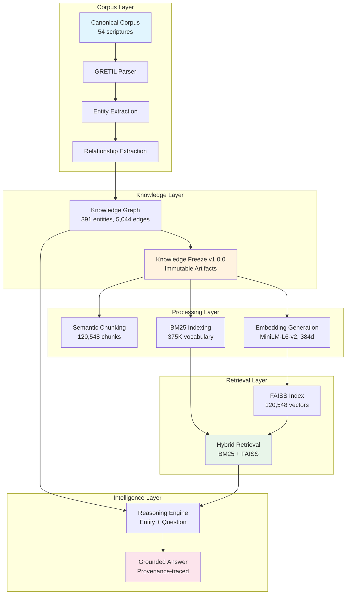
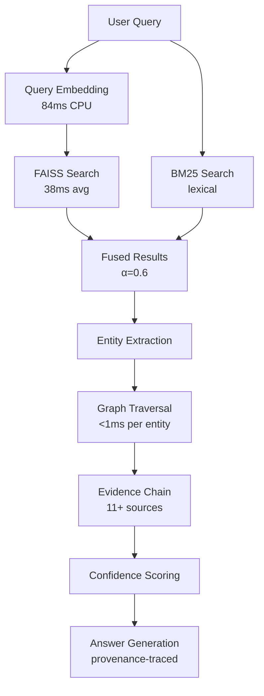
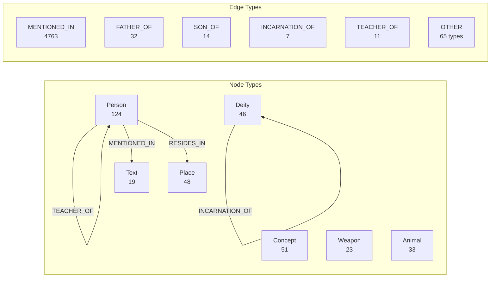
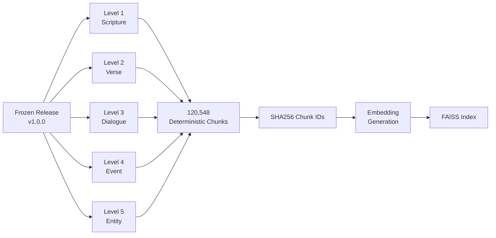
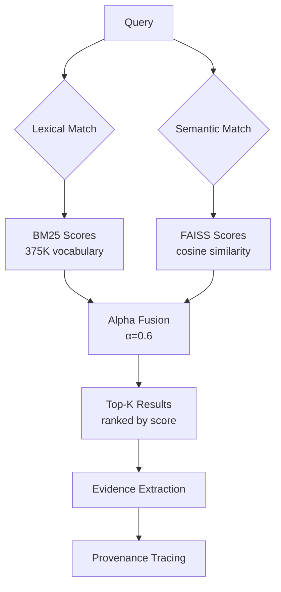
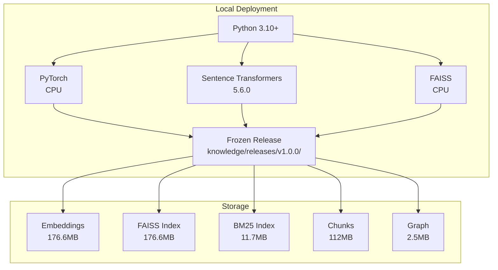
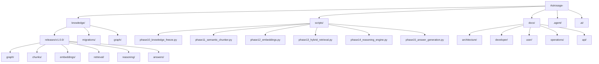

# AstroSage Architecture Diagrams

**Version**: 1.0.0

---

## 1. Overall Architecture

---

## 2. Data Flow

---

## 3. Knowledge Graph Structure

---

## 4. Chunk Pipeline

---

## 5. Retrieval Flow

---

## 6. Deployment Architecture

---

## 7. Repository Structure

